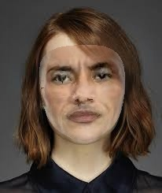

# 🧠 FaceMesh

**FaceMesh** is a small Python project that combines **MediaPipe** and **OpenCV** to align one face (source) to another (target) using 2D face landmarks.  
It detects the key points of both faces and warps the source image to match the geometry of the target face.

This project was created for learning purposes and to experiment with basic concepts of **computer vision** and **image warping**.

---

## 📦 What it does

- Detects **468 facial landmarks** using MediaPipe
- Builds a **Delaunay triangulation** over the target face
- Warps the source image triangle by triangle to match the target
- Optionally uses **Poisson blending** for smooth edges
- Outputs a new image where the source face is adapted to the target

---

## ⚙️ Installation

```bash
git clone https://github.com/yourusername/facemesh.git
cd facemesh

# Create virtual environment
python3 -m venv venv
source venv/bin/activate 

# Install dependencies
pip install -r requirements.txt
```

## ▶️ Usage

Place your images in the `data/` folder:

data/samples/source.jpeg → the source face 
\
data/target.jpeg → the target face

Run the program:

```bash
python -m facemesh.cli \
  --src data/samples/source.jpeg \
  --tgt data/target.jpeg \
  --out outputs/output.jpg \
  --poisson
```

The resulting image will be saved in the `outputs/` folder.

## Examples

|         Source          |         Target          |         Output          |
| :---------------------: | :---------------------: | :---------------------: |
|  |  |  |

